# feedApp

Link to FeedApp Prototype

https://www.figma.com/proto/zPL5XPxChQ4h15uQA2uKYf/Feed-App?type=design&node-id=6-20&scaling=scale-down&page-id=0%3A1&starting-point-node-id=6%3A20

 
<video controls autoplay muted src="https://stewietech.github.io/feedApp/assets/videoFeed.mp4" title="Title"></video>

### Branches

#### Login
Before users can log in and write posts, they'll need to verify their emails with us.
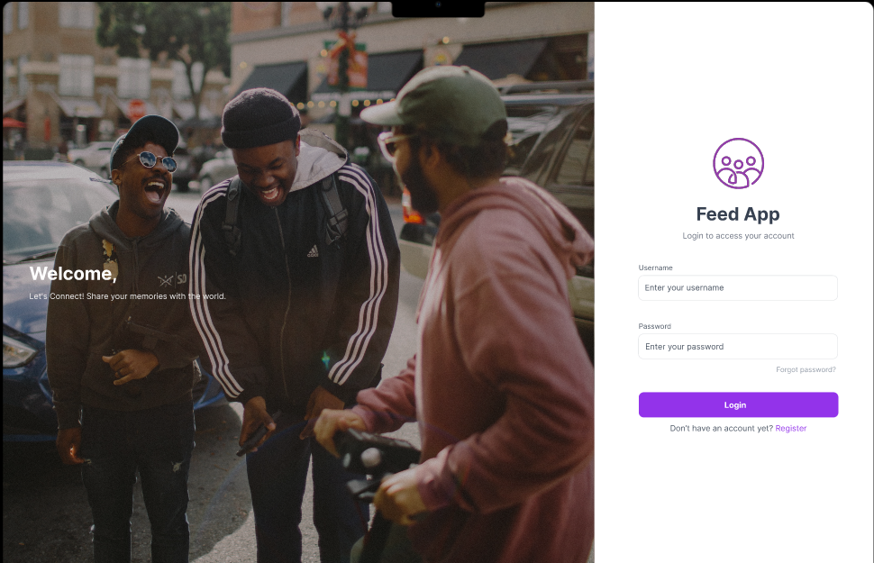

#### Register / Signup
Our users will be able to sign up to use the FeedApp, but we will also be sending them a verification email and checking to ensure that they do exist. To do so, we'll use JSON Web Tokens, one of the most important and widely-used security measures in web technology today. 
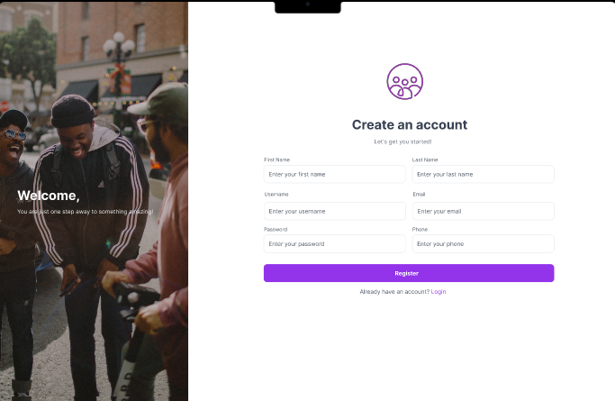

#### Forgot Password
If a user needs to reset their password, we'll facilitate the process by emailing and using JWTs to authenticate their access. 
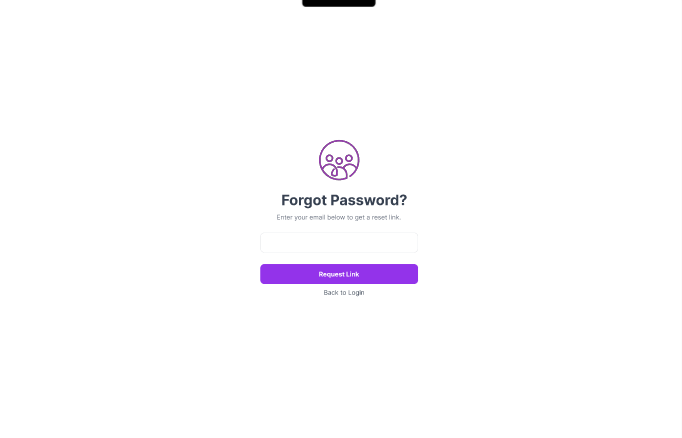
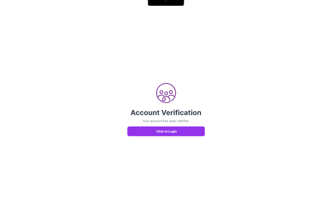
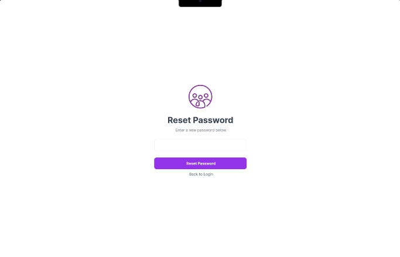

#### Timeline / Feed
- Users can add a new feed post with written content and an optional image.
- View feeds of all the users, including images and written content. They can also apply pagination to the posts. We'll implement a "pull to refresh" feature to optimize the speed for first-time page loads.
- Users can view their feeds and see who liked and commented on them.
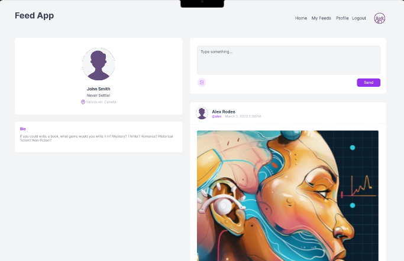
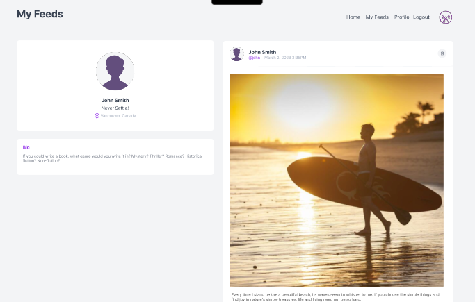

#### Edit Public Profile
Users can update their profile in three ways: updating their basic profile text, changing their profile picture, or cropping their picture. They can also change their passwords.
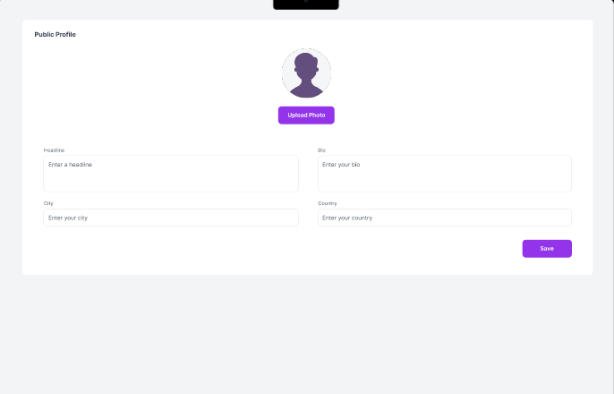
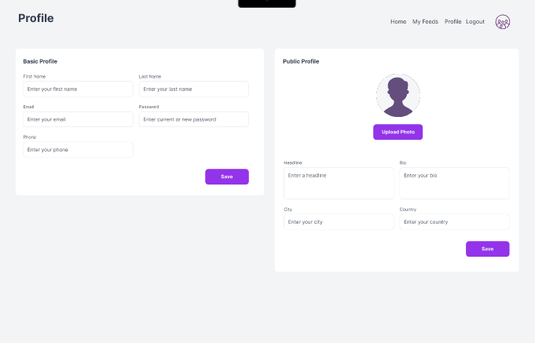

### Database Interaction Features
Get Feed By Id: Given a user's ID, we will retrieve all of the necessary data to display their specific feed and display it for them.

Get User Feeds: When not provided a user ID, we'll get all the available feeds for display.

Get Other Users' Feeds (Paged): When users navigate to another user's page, we'll display that feed as its page. 

Create Feed: For signed-in users, we'll have a page for them to create a feed. This data will be persisted in our database accordingly.

Create FeedMetaData: We'll write the code for creating comments, specifying which users like which feeds and where the comments/likes are placed.

Delete Feed: Should a user need to remove a feed from their page, we will provide them with the option, complete with appropriate checks, before we let them complete their deletion.

And more. There will be other endpoints for other features, but the above is a good set to start with.
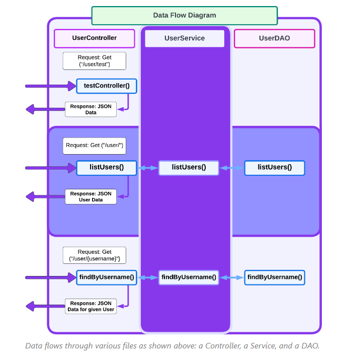
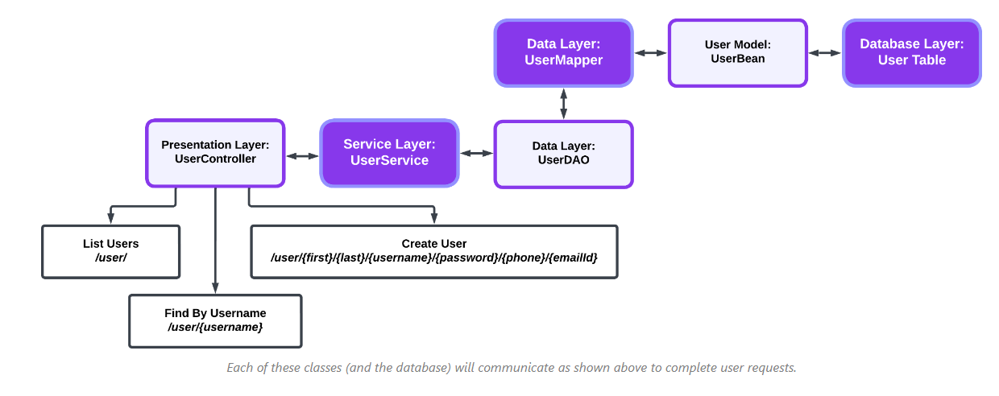
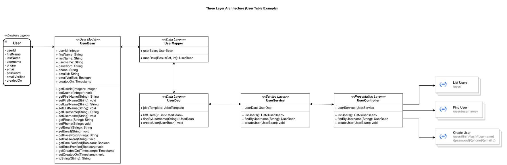

